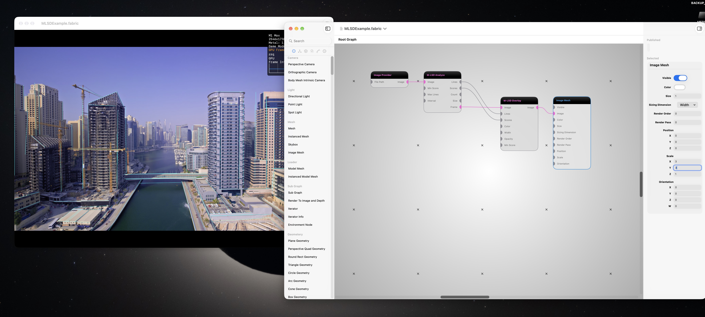
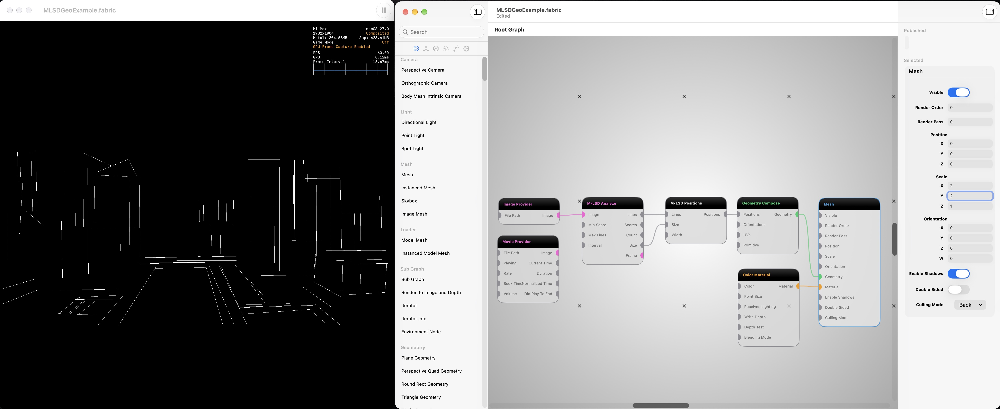

# Fabric M-LSD Node

This repository owns a reusable macOS Swift package for M-LSD structural-line
analysis and its Fabric plug-in integration. The package bundles the pinned
M-LSD 512-tiny Core ML model and its Apache-2.0 license, resizes Metal textures
into the model's image input, and decodes up to 200 scored line segments into a
validated `StructuralLineFrame`.

Each segment owns two junction entries because M-LSD does not infer shared
topology. Public positions use normalized full-image bottom-left coordinates;
the decoder clamps endpoints at that public contract boundary. Host
applications own scheduling and rendering. The package has no dependency on
Fabric, Satin, MESS, MessScene, Python, TensorFlow, or TFLite at runtime.

The Fabric plug-in provides three nodes: an analysis node that publishes typed
segment data, a separate overlay node that renders those segments, and a
positions node that places them on a flat XY plane.
User-authored sample `.fabric` scenes will demonstrate both the
direct overlay path and independent use of the analysis outputs. See
[`docs/internal/handoffs/fabric-mlsd-node.md`](docs/internal/handoffs/fabric-mlsd-node.md)
for current milestone status.

Current Fabric constraints, the plug-in's local adaptations, and candidate
host API improvements are tracked in
[`docs/FABRIC_INTEGRATION_GAPS.md`](docs/FABRIC_INTEGRATION_GAPS.md).

## Node port reference

### M-LSD Analyze

Runs M-LSD 512-tiny asynchronously and publishes the latest completed analysis.

| Port | Direction | Fabric type | Default or requirement | Description |
| --- | --- | --- | --- | --- |
| `Image` | Input | `Image` | Required | Image to analyze in its Fabric presentation orientation. |
| `Min Score` | Input | `Float` | `0.05`; range `0...1` | Minimum model confidence required to retain a line. |
| `Max Lines` | Input | `Int` | `200`; range `1...200` | Maximum number of highest-confidence lines to publish. |
| `Interval` | Input | `Int` | `1`; range `1...120` | Analyze every Nth changed input image; parameter changes analyze immediately. |
| `Lines` | Output | `Array<Vector4>` | Up to 200 values | Each value is `[startX, startY, endX, endY]` in normalized bottom-left coordinates. |
| `Scores` | Output | `Array<Float>` | One value per `Lines` element | Confidence values index-aligned with `Lines`. |
| `Count` | Output | `Int` | — | Number of lines in the latest completed analysis. |
| `Size` | Output | `Vector2` | — | Presentation width and height of the analyzed image. |
| `Frame` | Output | `Image` | — | Source image paired with the completed `Lines`, `Scores`, and `Size` result. |

### M-LSD Overlay

Draws compatible normalized line segments over an image without running
inference.

| Port | Direction | Fabric type | Default or requirement | Description |
| --- | --- | --- | --- | --- |
| `Image` | Input | `Image` | Required | Background image. Connect Analyze `Frame` for frame-aligned results. |
| `Lines` | Input | `Array<Vector4>` | Empty allowed; maximum 200 | Normalized bottom-left `[startX, startY, endX, endY]` segments. |
| `Scores` | Input | `Array<Float>` | Optional | Confidence values aligned one-to-one with `Lines`; omitted values are treated as confidence 1. |
| `Color` | Input | `Vector4` color | Cyan `(0, 1, 1, 1)` | Overlay line color and alpha. |
| `Width` | Input | `Float` | `2`; range `0.5...32` | Line width in presentation pixels. |
| `Opacity` | Input | `Float` | `1`; range `0...1` | Multiplier applied to the color alpha. |
| `Min Score` | Input | `Float` | `0`; range `0...1` | Draw only lines meeting this score; meaningful when aligned `Scores` are connected. |
| `Image` | Output | `Image` | RGBA16-float | Source image with anti-aliased structural lines, or the unchanged source when no lines are visible. |

### M-LSD Positions

Converts the normalized 2D line contract into planar positions that Fabric can
feed to geometry nodes.

| Port | Direction | Fabric type | Default or requirement | Description |
| --- | --- | --- | --- | --- |
| `Lines` | Input | `Array<Vector4>` | Empty allowed; maximum 200 | Normalized bottom-left line segments from Analyze or a compatible producer. |
| `Size` | Input | `Vector2` | Required when `Lines` is nonempty | Presentation width and height used to preserve the source aspect ratio. |
| `Width` | Input | `Float` | `1`; range `0.001...1000` | Width of the centered XY plane in world units. |
| `Positions` | Output | `Array<Vector3>` | Two values per line | Ordered start/end pairs on an aspect-correct XY plane. Every position has `z = 0`; no depth or shared topology is inferred. |

## Overlay example

The user-authored [MLSDExample.fabric](FabricScenes/MLSDExample.fabric) scene
connects an Image Provider to `M-LSD Analyze`,
passes its `Frame`, `Lines`, and `Scores` to `M-LSD Overlay`, and displays the
result with Image Mesh.



## Geometry example

The user-authored [MLSDGeoExample.fabric](FabricScenes/MLSDGeoExample.fabric)
scene converts the same analysis into renderable line geometry. Its essential
wiring is:

```text
Image Provider: Image → M-LSD Analyze: Image
M-LSD Analyze: Lines → M-LSD Positions: Lines
M-LSD Analyze: Size → M-LSD Positions: Size
M-LSD Positions: Positions → Geometry Compose: Positions
Geometry Compose: Geometry → Mesh: Geometry
Color Material: Material → Mesh: Material
```

Set `Geometry Compose` to `Primitive = Line`. The `Size` connection is
required for nonempty lines because it preserves the analyzed image's aspect
ratio; omitting it produces a recoverable validation error. The included
scene uses the bundled `DubaiTestImage.jpg` through Image Provider.



## Development layout

The default local layout is:

```text
MAC_APPS/
├── Fabric/
└── FabricMLSDNode/
```

The reusable `MLSDStructuralLineKit` package is rooted at this repository's
`Package.swift`. The native plug-in target lives under `FabricMLSDNode/` and
builds against the adjacent Fabric checkout. Override its location with the
`FABRIC_SOURCE_ROOT` build setting when necessary.

## Build and install

Build the reusable package and its reference tests with:

```sh
swift test
```

Open `FabricMLSDNode/FabricMLSDNode.xcodeproj` and build the
`FabricMLSDNode` scheme, or run:

```sh
xcodebuild \
  -project FabricMLSDNode/FabricMLSDNode.xcodeproj \
  -scheme FabricMLSDNode \
  -configuration Debug \
  -destination 'platform=macOS' \
  build
```

The build prepares the matching Fabric Swift module, builds the plug-in, and
installs a development-signed bundle at:

```text
~/Library/Application Support/Fabric/Plugins/FabricMLSDNode.fabricplugin
```

Use the same configuration for Fabric Editor and the plug-in. Restart Fabric
Editor after rebuilding because Fabric discovers plug-ins when its node
registry starts. Fabric is compiled in the repository-local `.fabric-spm/`
scratch directory so the plug-in build does not depend on or overwrite the
adjacent checkout's existing `.build` cache.

## Analysis node contract

The plug-in registers `M-LSD Analyze`. It accepts an `Image` plus `Min Score`
(minimum confidence), `Max Lines`, and `Interval` parameters. It publishes:

- `Lines`: `Array<Vector4>`, with each value packed as
  `[startX, startY, endX, endY]` in normalized bottom-left coordinates.
- `Scores`: an index-aligned confidence `Array<Float>`.
- `Count`: the number of completed segments.
- `Size`: the analyzed image's presentation width and height.
- `Frame`: the source image paired with those completed segments.

The node encodes orientation-aware preprocessing into Fabric's current command
buffer, then performs Core ML inference asynchronously after GPU completion.
It permits one active inference and retains only the newest eligible pending
image. Outputs therefore represent the latest completed interactive analysis;
Fabric currently has no same-frame asynchronous barrier for deterministic
export. That limitation is detailed in the integration-gaps document above.

## Overlay node contract

`M-LSD Overlay` accepts an `Image`, `Lines` in the
analysis node's normalized bottom-left `Array<Vector4>` format, and optional
index-aligned `Scores` (`Array<Float>`). Connect the analysis node's
two array outlets to the identically named overlay inlets. The overlay works
with any compatible segment producer; it does not run inference.

For frame-aligned interactive results, connect analysis `Frame` to the overlay's
`Image` inlet. Connecting the current upstream image instead is possible, but
its content can be newer than the asynchronously completed line arrays.

The overlay has line color, width in presentation pixels, opacity, and minimum
confidence controls. If confidences are omitted, every line is treated as
confidence 1. It accepts at most 200 lines with finite normalized endpoints;
if confidences are connected, their count must match. Invalid arrays produce
a recoverable Fabric execution error. With no visible lines it passes the
source image through. Otherwise it copies the stored image, draws anti-aliased
lines in presentation space, and preserves the source image's Fabric texture
transform on the output. Its output is an RGBA16-float `Image`.

The offscreen Metal shader fixture can be run against an installed bundle with:

```sh
swift scripts/verify_overlay_shader.swift \
  "$HOME/Library/Application Support/Fabric/Plugins/FabricMLSDNode.fabricplugin"
```

## Positions node contract

`M-LSD Positions` converts analysis `Lines` and `Size` into a typed
`Array<Vector3>` named `Positions`. Connect both analysis outlets to the
matching inlets. Every line contributes two consecutive positions (start,
end), with no endpoint merging or shared-junction inference. The node does
not filter by score; use analysis `Min Score` and `Max Lines` to select lines.

`Width` (default 1 world unit) controls the width of a centered XY plane at
`z = 0`. The height follows the analyzed image's presentation aspect ratio.
Normalized bottom-left `(0, 0)` maps to the plane's lower-left corner and
`(1, 1)` to its upper-right corner. With Image Mesh set to `Size = Width` and
`Sizing Dimension = Width`, both occupy the same plane before object
transforms. The positions are planar placements, not recovered 3D depth.

For an initial geometry experiment, connect `Positions` to Fabric's
`Geometry Compose`, set its `Primitive` to `Line`, then connect its `Geometry`
to a `Mesh` with a material. The ordered pairs form independent line
segments. The included geometry example demonstrates this path. Fabric's
current `Geometry Compose` only replaces its vertex data
when Positions is nonempty; when detections drop to zero, it may continue
showing the previous lines. The nonempty → empty transition has not yet been
verified in the live example. A dedicated geometry node remains a separate
milestone if that host limitation prevents a correct live graph.

## Samples

[`FabricScenes/`](FabricScenes/) includes direct-overlay and geometry scenes,
their screenshots, and the shared
[`DubaiTestImage.jpg`](FabricScenes/DubaiTestImage.jpg) source image. After
cloning, open either scene in Fabric Editor and use Image Provider's `File
Path` picker to reselect the included JPEG, then save the scene. Fabric
currently stores that path as an absolute file URL, so the author's saved path
will not resolve on another machine.

See [ResearchFixtures/MLSD/PROVENANCE.md](ResearchFixtures/MLSD/PROVENANCE.md)
for model source and license pins, conversion, independent reference fixtures,
and measured Apple-runtime performance.

Developers evaluating another official checkpoint family should follow
[`BUILDING_MODEL_VARIANTS.md`](BUILDING_MODEL_VARIANTS.md). Conversion tooling
supports selecting the official 320/512 and tiny/large families, but the
shipping Swift runtime remains deliberately pinned to the verified 512-tiny
artifact until another variant completes the documented integration and
acceptance process.
